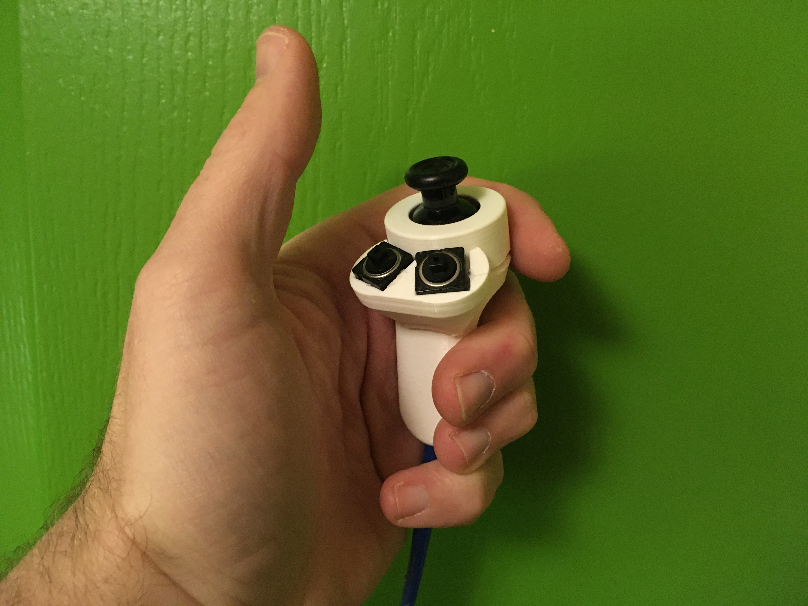
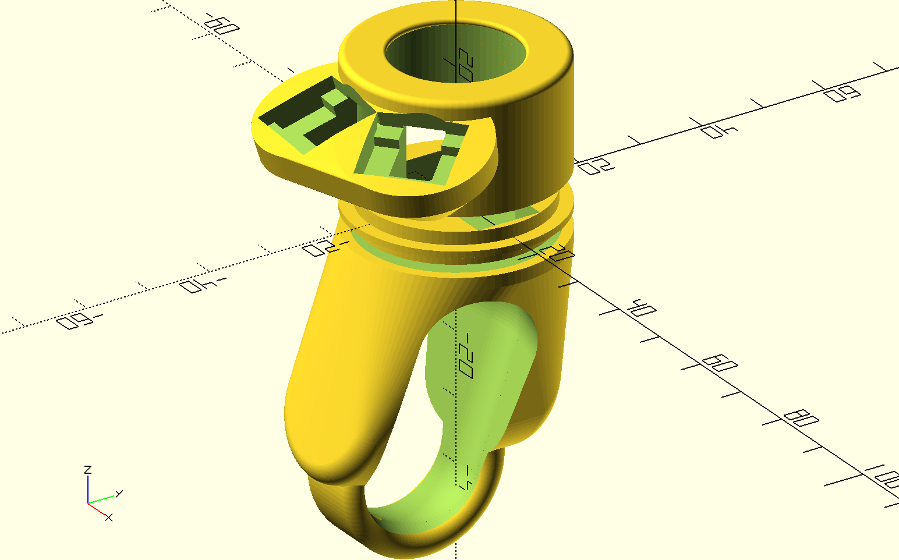

# splitcontroller
code and hardware files for a split level game controller

This project has been designed for a Duchenne patient who had progressive trouble operating his beloved regular PS4 controller. The original controller has been 'bridged' or patched by an Arduino Due (the PS4 controller works on 3.3V, so an Arduino with many inputs and outputs running at 3.3V is convenient). As new controller a split handheld system is used. This can be consisting of two Wii-nunchuck controllers or two custom 3D printed handheld controllers using (in this case) original PS4 joysticks. Currently this repository contains the following directories: 
  * bridge firmware: the firmware for the Arduino Due. Pinout is given in the header part of the code. The Wii-nunchuck functions are included in the code by Tod E. Kurt (2017) and modified for use on the DUE
  * remote arduino box: a simple laser cut 'sandwich' plate box containing a severely stripped-down ps4 controller, the arduino due and a 8000mAh powerbank. Included are some pictures and an svg file for cutting. Schematic drawing will follow. 
  * remote-modular ps4: an openSCAD script and printable STL files for a customisable hand-held design
  * remote-modular-switch: an openSCAD script and printable STL files for a customisable hand-held using the miniature nintendo-switch joystick

# bridge firmware
This code is meant for an Arduino Due which is used to take input signals from two handheld controllers, such as Wii-nunchucks or custom build controllers wired to A0--A7, and parse these signals to a modified PS4 controller. 

# remote arduino box
Simple laser cut 'sandwich' plate box containing a severely stripped-down ps4 controller, the arduino due and a 8000mAh powerbank. Further electonics consist of two 12-LED neopixel style ring-lights for feedback, a protoshield containing series resistors and RC filters for generating output signals to the PS4 controller. A small thin patching pcb for PS4 has been added to connect the Arduino due to the remnants of the PS4 controller. In order to connect two nunchucks to one I2C port, a PCA9540B I2C multiplexer has been added to the nice SMD proto-area of the used Adafruit Arduino MEGA protoshield. 

 

# remote-modular ps4
This directory contains an openSCAD script to generate a modular parametric hand-held controller using a standard PS4 joystick (replacement part) and two pushbuttons. For connectivity a flat (flexible) 6mm wide UTP cable has been used. Standard RJ45 plugs are used to connect these hand-helds to the arduino box. 

 

# disclaimer
Hopefully stating the obvious: no guarantees can be given that these plans are correct or will work in your case or are safe. You will undoubtedly void the waranty on any PS4 controller you bought when you cut it down into functional bits and start adding wires and other functions. Re-selling any of this is probably actively prohibited by the Sony coorperation, so don't. Powering the device from a portable source such as a 5V power bank makes sense: Don't power wired handhelds with a supply directly connected to the mains. Maintain galvanic separation at all times (and if you don't know what that means, you should not be building this stuff). 
